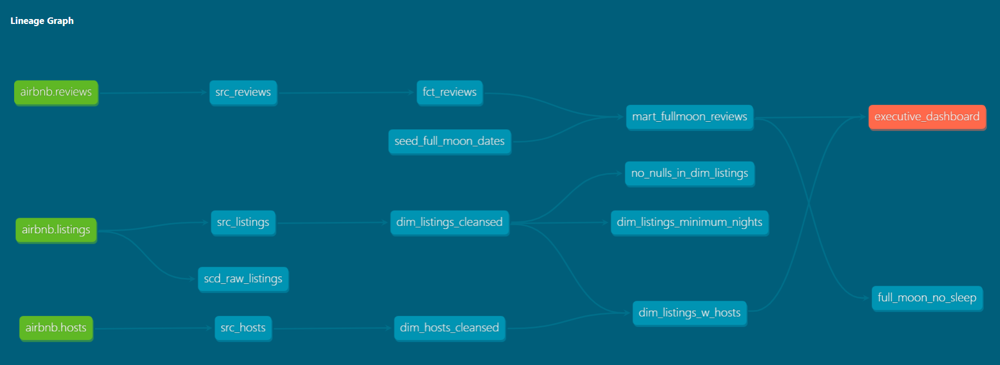
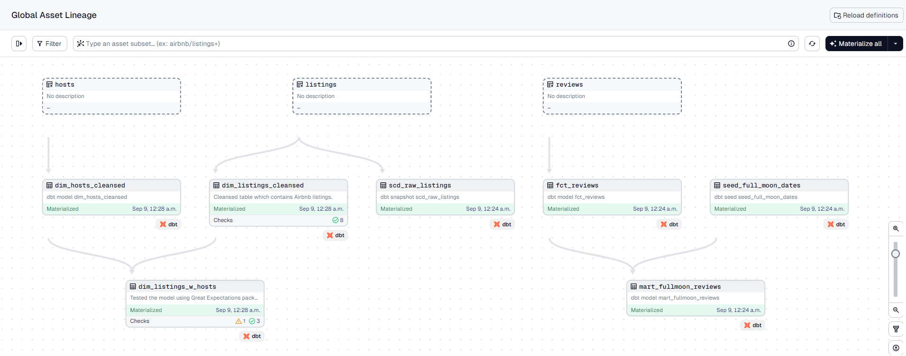
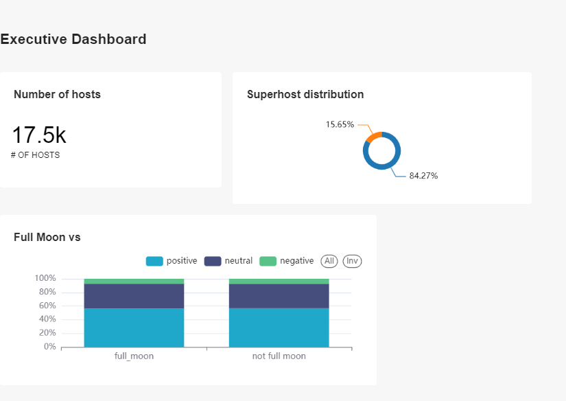

# Airbnb Data Analytics Pipeline using DBT, Snowflake and Dagster

## Objective

To build a robust and scalable data analytics pipeline that efficiently processes raw data from **Snowflake**, transforms it using **DBT**, and provides insightful visualizations via **Preset.io** dashboards. The pipeline is **orchestrated with Dagster** to ensure automated and reliable execution of ETL processes, including Slowly Changing Dimensions (SCDs), incremental loads, and marts for reporting.

## Project Overview

This project demonstrates a comprehensive data analytics solution using modern data tools and best practices. The goal is to extract raw data from Snowflake, transform it using DBT (Data Build Tool), and visualize the results through interactive dashboards on Preset.io. The pipeline is orchestrated using Dagster, ensuring that all transformations and data loads are automated and reliable.

### Key Features

- **Data Transformation with DBT**: Implemented various transformations, including SCD (Slowly Changing Dimensions) and incremental loads, to convert raw data into a structured format suitable for analytics and reporting.
- **Orchestration with Dagster**: Automated the entire data pipeline using Dagster, ensuring smooth and reliable execution of data workflows.
- **Data Warehouse on Snowflake**: Utilized Snowflake as the cloud data warehouse to store both raw and transformed data, ensuring scalability and security.
- **Dashboarding with Preset.io**: Created dynamic and interactive dashboards using Preset.io to provide insights into the transformed data for better decision-making.

## Project Components

### 1. Input Schema
The input schema represents the raw data structure from Airbnb, which is loaded into Snowflake.

### 2. DBT Modeling
The DBT modeling shows the lineage of transformations applied to the raw data, including incremental loads and SCDs.

### 3. Dagster Lineage
The Dagster lineage provides an overview of the orchestration flow, ensuring that all transformations and data loads are executed in a reliable and automated manner.

### 4. Preset Dashboard
The Preset.io dashboard showcases the final visualization of the transformed data, providing insights into Airbnb listings, prices, and other key metrics.

